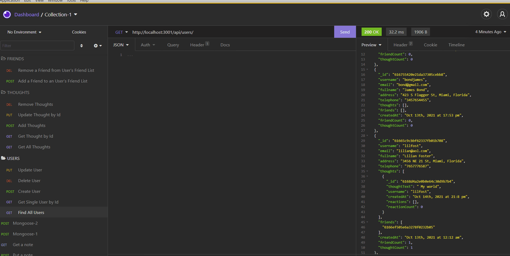

<h1 align="center">Social Network API 👋</h1>

## Description

*An API for a social network web application where users can share their thoughts, react to friends’ thoughts, and create a friend list. This application uses Express, Node, MongoDB and Mongoose to allow users, thoughts, friend lists and thought reactions to be created, updated and deleted.*


## Table of Contents

- [Description](#description)
- [Table of Contents](#table-of-contents)
- [GIF Files](#gif-files)
- [Walkthrough VDO](#walkthrough-video)
- [Github Repository](#github-repository)
- [User Story](#user-story)
- [Acceptance Criteria](#acceptance-criteria)
- [Installation](#installation)
- [Usage](#usage)
- [Technologies](#technologies)
- [Questions](#questions)
- [Copyright](#copyright)


## GIF Files

- GIF for GET all Users and Thoughts.


- GIF for GET Single User and Thought.


- GIF for Create, Update and Delete Users


- GIF for Add, Update and Delete Thoughts


- GIF for Add and Delete Friends for Users


- GIF for Add and Delete Reactions to Thoughts


- GIF for Delete an User With Associated Thoughts/Reactions




## Walkthrough Video

- [Application walkthrough Insomnia](https://www.youtube.com/watch?v=gDaMHFvF6Xs)

- [Front End Application Walkthrough](https://watch.screencastify.com/v/NooD095Eh21cms12nMIt)

## Github Repository
- [GitHub Repository](https://mirzadev.github.io/Social-Network-Api/)

## User Story
```text
AS A social media startup
I WANT an API for my social network that uses a NoSQL database
SO THAT my website can handle large amounts of unstructured data.
```

## Acceptance Criteria

```text
GIVEN a social network API
WHEN I enter the command to invoke the application
THEN my server is started and the Mongoose models are synced to the MongoDB database
WHEN I open API GET routes in Insomnia Core for users and thoughts
THEN the data for each of these routes is displayed in a formatted JSON
WHEN I test API POST, PUT, and DELETE routes in Insomnia Core
THEN I am able to successfully create, update, and delete users and thoughts in my database
WHEN I test API POST and DELETE routes in Insomnia Core
THEN I am able to successfully create and delete reactions to thoughts and add and remove friends to a user’s friend list.
```

## Installation
💾     
- Clone github repository
- npm init
- npm install mongoose
- npm install Express
- npm install bcrypt
- npm install -g nodemon

## Usage
💻   
  
Run the following command at the terminal:

`npm start`

## Technologies 
* JavaScript
* Node.js
* MongoDB
* Mongoose
* Express.js

## Questions
✉️ Contact me with any questions: [email](mailto:awal.mirza2016@gmail.com) , [LinkedIn](https://www.linkedin.com/in/mirza-awal-5972511b5/)>

## Copyright
*This application is copyright protected and only owners is 
:: [Mirza Awal](https://github.com/mirzadev)
